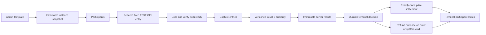
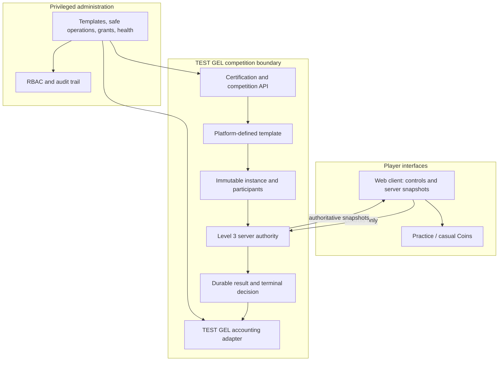

# Fugluck — Technical Review Dossier (Sandbox Candidate)

**Package status:** internal technical review package; not a legal opinion, filing, or authority submission.
**Evidence date:** 2026-09-25. **Code source revision:** `3d8922fd251ffbeb6d0ededade578fd3c6b8bbaa`.
**Environment:** local automated integration checks against the guarded disposable PostgreSQL test database. A separate previously accepted Cyber Hopper test was physically played on staging; see the Phase 5.5B1 report.
**Commercial boundary:** this candidate uses simulated balances only. It has no live payment rails, real-value prizes, deposits, withdrawals, bank or PSP integration, or card processing. No external submission is included.

**Verification labels:** implementation descriptions below are BUILT/source-inspected unless explicitly labeled a test result or limitation. Automated evidence refers to the exact scripts and counts in the linked records; it does not imply a hosted deployment or legal conclusion.

## Reviewer summary

Fugluck is a skill-game platform with practice and casual Coins play plus a separate, platform-defined TEST GEL competition domain. Competition terms come from administrator-controlled templates and are snapshotted into an instance. Each player sees a fixed entry fee and a predetermined prize as separate values. The two games currently eligible for TEST GEL prize competitions are Space Blaster and Cyber Hopper, each under its own versioned Level 3 live-authority rules. The client sends controls and displays server snapshots; the server runs the game state, score, collision and terminal decision.

The implementation and checks support a technical review of those boundaries. They do not establish a legal classification, approval, production service capacity, a staging backup/restore drill, or physical Space Blaster acceptance. Phase 6D staging revision alignment and visual acceptance remain separate final-release checks.

## 1. Product and player journey

1. A player can use practice and casual Coins modes separately from prize competitions.
2. On the competition catalog, the player sees server-provided game, format, capacity/status, entry fee, predetermined prize and availability. A freeroll labels entry `FREE`. Simulated currency is labeled TEST / SANDBOX / NO REAL MONEY.
3. Joining uses the template identifier only. The server validates certification, creates/reuses an immutable instance snapshot, verifies capacity, authenticates the player, and reserves the fixed TEST GEL entry.
4. When both participants are ready and admitted, the server captures the reservations and creates the certified authority sessions. A guest can follow free-play paths but cannot join a paid TEST GEL competition; the paid path requires sign-in and sufficient TEST GEL.
5. The server runs the competition and sends snapshots. The client supplies controls only. The terminal decision settles the fixed prize once, or refunds/releases entries when the result is a draw or the system cannot establish a justified winner.

Verified UI scope includes landing/home, authentication and policy consent, games, practice, profile/social, catalog/entry dialogs, wallet, legal/help, 404/error/loading states, and responsive competition surfaces through the product UI checks. Automated layout checks are not a substitute for current staging visual inspection at every viewport.

## 2. Player domains and money boundary

| Domain | Current behavior | Boundary |
|---|---|---|
| Practice | Local game play | No competition entry or prize ledger |
| Casual Coins | Non-monetary casual game currency | Cannot convert to TEST GEL |
| TEST GEL competition | Server-defined competition entry and prize | Simulated only; no deposit, withdrawal, redemption, or real-world value |
| Historical Diamonds | Preserved ledger/history display where needed | New grants, purchases, queueing and competition use are retired |

No player selects a monetary stake, chooses a prize, bets on another person, or bets on an external event. The service currently exposes no active bank, card, PSP, payment, withdrawal, or real-prize path. This is a source-code and automated-test finding, not a promise about future changes.

## 3. Templates, immutable instances and prize formats

Administrators define the game/rules version, format, participant capacity, entry, enablement and predetermined prize schedule in a competition template. A new instance snapshots its terms and prize schedule; later template changes apply to future instances. Lifecycle state changes do not rewrite the snapshot.

The accounting layer and UI support standard paid competitions, independently subsidized promotional prizes and freerolls. The live authority runner currently accepts only two-player `HEAD_TO_HEAD` competitions with exactly one first-place prize; other runtime formats are rejected rather than silently run through a different path. The accounting unit checks also exercise multi-placement primitives, but that does not mean multi-placement gameplay is enabled.

**Accounting scenarios (integer minor units, sandbox only):**

| Scenario | Entries | Predetermined prize | Funding result |
|---|---:|---:|---|
| Standard | 2 × TEST ₾5 | TEST ₾9 | Captured TEST ₾10; prize TEST ₾9; margin TEST ₾1 |
| Promotional | 2 × TEST ₾5 | TEST ₾20 | Captured TEST ₾10 plus TEST ₾10 promotional subsidy |
| Freeroll | FREE | TEST ₾1,000 in the accounting fixture | No participant entry capture; prize funded by simulated subsidy |

The amounts are examples in the disposable test suite and are not offered as an active live event or money payout.

## 4. Game eligibility and authority

| Game | TEST GEL prize-competition status | Rules / authority version |
|---|---|---|
| Space Blaster | Level 3 certified | `space-blaster-rv001-v1` |
| Cyber Hopper | Level 3 certified | `cyber-hopper-rv001-v1` |
| Neon Runner | Not certified | blocked |
| Pixel Ninja Dash | Not certified | blocked |
| Speed Trivia Clash | Outside current prize scope | blocked |
| True / False Sprint | Outside current prize scope | blocked |

`GAME_COMPETITION_CERTIFICATIONS` is the shared eligibility source; server template creation, enabling, instance creation and join paths enforce it. UI checks provide an additional guard. The default legacy Cyber Hopper `ch-1.0` route is not made eligible by the controlled-trial acceptance. Historical authority trial `tmpl_cyber_hopper_authority_trial` was disabled after the accepted Phase 5.5B1 staging run.

### Authority boundary and result integrity

The versioned server runtime binds a session to authenticated user, competition instance, match, game, rules version, controller identity, nonce and fencing epoch. Admission samples are checked against p95 RTT ≤100 ms and p95-minus-median jitter ≤30 ms; the server does not automatically relax these limits. Both player sessions must be ready before start/capture. Client messages carry permitted controls and monotonically sequenced references; client-provided score or winner fields are rejected.

The server runs the fixed-step engine and owns authoritative movement, hazards, collisions and scoring. Space Blaster owns ship movement, shot/asteroid collision and score. Cyber Hopper owns grid movement, seeded moving-car hazards, collision and score. Immutable result rows feed one durable terminal decision. A tie produces no winner and is refunded; a valid forfeit can award the opponent; uncertain system failure voids/refunds instead of guessing a winner.

Reconnect uses the same server run but rotates controller nonce/epoch; the replaced controller is fenced. Lease ownership and terminal decisions are durable. These behaviors are exercised in local suites. The accepted physical Cyber Hopper test did not include an intentional disconnect, so the reconnect statement is supported by automated checks, not that physical session.

## 5. Competition and accounting lifecycle

The TEST GEL adapter uses append-only double-entry ledger postings with idempotency references. Reservations move available balance to reserved balance; capture transfers the entry to competition escrow. Settlement debits escrow and credits the predetermined winner prize; an independently funded promotional subsidy covers prize amounts above captured entries. Cancellation before capture releases reservations; a post-capture void refunds participants. Reconciliation checks instance-level captured entries, prizes, subsidy, margin and refunds, as well as system ledger balance.

Duplicate settlement/refund requests do not create duplicate ledger effects. Settled instances and their evidence are not editable through admin controls. The supported failure policy does not invent a winner for server uncertainty, missing results or both players disconnecting.

## 6. Admin controls and audit boundary

The admin console provides user search/detail and TEST GEL grants; competition templates and instance inspection; safe cancellation/void operations; sandbox balances, ledger and reconciliation; game certification status; operations health; and audit history. Admin grant flows require permission, integer minor units, reason and review/confirm, and record ledger plus audit reference together.

The implemented admin API does not provide a winner-pick operation, score rewrite, settled-history edit, ledger-row edit/delete, direct balance set, new Diamond grant or real-payment control. Competition mutations are RBAC-guarded and audit-recorded. Operations health is separately guarded by `ADMIN_VIEW_AUDIT`; recent process telemetry is bounded and non-durable as described in the [Phase 6B runbook](PHASE_6B_OPERATIONAL_READINESS.md).

## 7. Security and operational evidence

Automated checks cover password and session rules, admin authentication and RBAC, CORS, rate limits, SQL parameterization, XSS boundary escaping, request-log secret redaction, registration verification, authority user/session/controller binding, input validation, settlement idempotency, and database destination safety. The current set includes no multipart upload feature; its file-upload audit records that condition. This package is not a third-party penetration test.

The backend has a liveness endpoint (`/health`), a database-aware health endpoint (`/api/health`), and protected admin diagnostics. The operations endpoint reports database reachability, migration metadata, revision, competition/authority status counts and reconciliation. The staging provider inspection found a Render `Production` environment badge on the service page despite its staging service name/custom hostname; release deployment must verify the exact service before acting. Current staging backup and restore remain unverified, so no schema change should be applied until the backup procedure in `DEPLOYMENT.md` is completed.

## 8. Known limitations

- The automated authority and capacity results below are local disposable-database/socket-harness results, not a cloud capacity benchmark or scale guarantee.
- Space Blaster has automated authority integration evidence but no new physical human gameplay acceptance in this package.
- Cyber Hopper has accepted physical two-device staging gameplay evidence, but that run did not intentionally exercise reconnect.
- Current staging data backup and disposable restore are not verified; there is no current Frankfurt-project dump artifact.
- The staging deployment is older than this feature branch at the last recorded provider inspection. Phase 6D must verify or update the exact matching staging revisions and visually recheck player/admin surfaces.
- This package does not claim legal classification, licensing, regulatory approval, filing readiness, or any regulator decision.

## 9. Technical evidence map

The non-developer entry point is [`docs/evidence/phase6c/EVIDENCE_INDEX.md`](evidence/phase6c/EVIDENCE_INDEX.md). It links to sanitized automated result records, the earlier physical Cyber Hopper acceptance, accounting assertions, and an SHA-256 manifest. Source maps include [`COMPETITION_ARCHITECTURE.md`](COMPETITION_ARCHITECTURE.md), `packages/shared/src/competitions.ts`, `packages/server/src/competitions/`, `packages/server/src/accounting/sandboxAdapter.ts`, and `packages/client/src/game-loader/AuthorityCompetition.tsx`.

## 10. Architecture diagram

